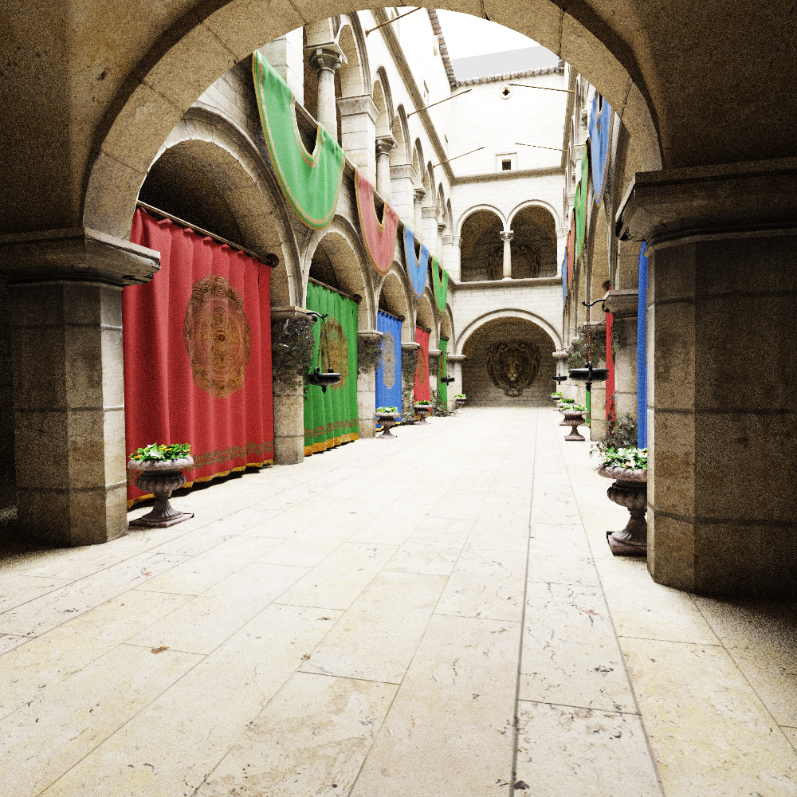

Рейтрейсер на CPU, написанный в рамках курса по фотореалистичному рендерингу изображений. Поддерживает сцены в формате gltf (с кучей ограничений), выводит результат в ppm.

## Пример работы
Sponza (вариант из репозитория курса), 1000x1000, 1000 семплов на пиксель, ~47 минут

